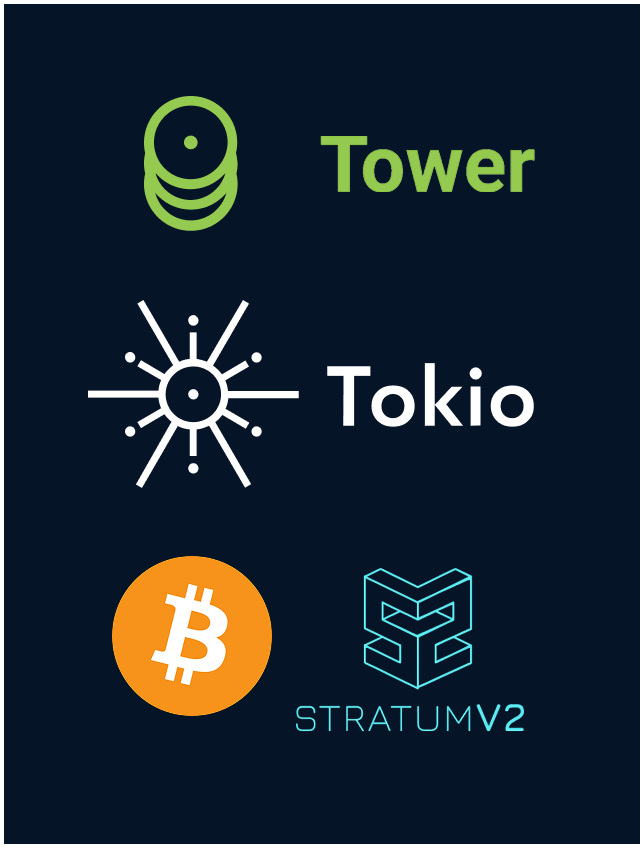

<h1 align="center">
   
  
   
tower-stratum
 
</h1>

🦀 Tower middleware for Bitcoin mining over <a href="https://github.com/stratum-mining/stratum">Stratum V2 Reference Implementation</a> ⛏️

This crate aims to provide a robust middleware API for building Bitcoin mining apps based on:
- [Tower](https://docs.rs/tower/latest/tower/): an asynchronous middleware framework for Rust
- [Tokio](https://tokio.rs/): an asynchronous runtime for Rust
- [Stratum V2 Reference Implementation](https://github.com/stratum-mining/stratum): the reference implementation of the Stratum V2 protocol

The goal is to provide a "batteries-included" approach to implement stateful Sv2 applications.

Note: currently development focus is on Stratum V2 (Sv2). While theoretically possible, Sv1 integration is not planned for the near future.

# Scope

`tower-stratum` provides [`Service`](https://docs.rs/tower/latest/tower/trait.Service.html)s and [`Layer`](https://docs.rs/tower/latest/tower/trait.Layer.html)s for building apps to be executed under `tokio` runtimes.

They can be divided in two categories:
- Client-side (`Sv2ClientService`)
- Server-side (`Sv2ServerService`)

The user is expected to implement handlers for the different Sv2 subprotocols, and use simple high-level APIs to compose Sv2 applications that are able to exchange Sv2 messages and behave according to the handler.

## Client-side

`Sv2ClientService<M, J, T>` is a `Service` representing a Sv2 Client.

It's able to establish a TCP connection with the Server and exchange `SetupConnection` messages to negotiate the Sv2 Connection parameters according to the user configurations.

It can listen for messages from the server and trigger `Service` `Request`s from them.

The user is expected to set the different generic parameters `<M, J, T>` with implementations for the handler traits of the different subprotocols:
- `trait Sv2MiningClientHandler` (example app: Sv2 CPU miner, Sv2 Proxy)
- `trait Sv2JobDeclarationClientHandler` (example app: Sv2 Job Declarator Client)
- `trait Sv2TemplateDistributionClientHandler` (example apps: Sv2 Pool, Sv2 Job Declarator Client, Sv2 Solo Mining Server)

For the subprotocols that are not supported, `Null*` implementations are provided.

## Server-side

`Sv2ServerService<M, J, T>` is a `Service` representing a Sv2 Server.

It's able to listen for TCP connections and exchange `SetupConnection` messages to negotiate the Sv2 Connection parameters according to the user configurations.

It can listen for messages from the server and trigger `Service` `Request`s from them.

Inactive clients have their connections killed and are removed from memory after some predefined time.

The user is expected to set the different generic parameters `<M, J, T>` with implementations for the handler traits of the different subprotocols:
- `Sv2MiningServerHandler` (example app: Sv2 Proxy, Sv2 Pool, Sv2 Solo Mining Server)
- `Sv2JobDeclarationServerHandler` (example app: Sv2 Job Declarator Server)
- `Sv2TemplateDistributionServerHandler` (example app: Sv2 Template Provider)

For the subprotocols that are not supported, `Null*` implementations are provided.

# Licence

[`MIT`](LICENSE)